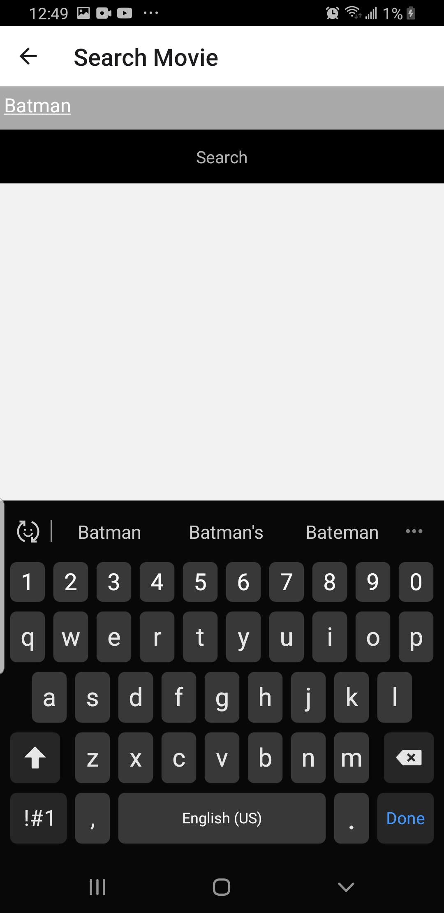
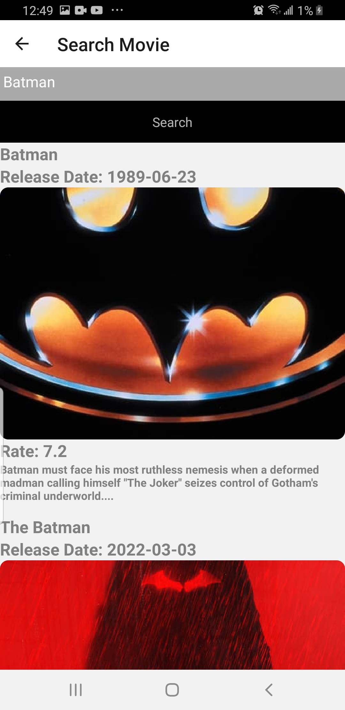

# MovieApp-ReactNative

## Program that is meant to be for practice purposes using moviedb API, and an auth API for login. Basically, it fetches the most popular movies, and also has 'Search' movie feature. If the user has already login, it won't require you again to enter credentials since they are stored locally on the phone.

### To run this app, you just need to download it, install the modules, and any npm package needed.

